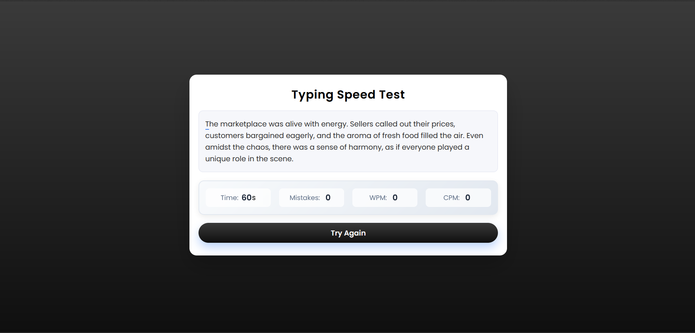

# ⌨️ Typing Speed Test Web Application

A clean and interactive **Typing Speed Test** web application built using **HTML, CSS, and JavaScript** to measure typing speed, accuracy, and performance in real time.

---

## 📖 Description

This project is a browser-based typing speed test designed to help users improve their typing accuracy and speed.  
It displays a randomly generated paragraph, tracks real-time typing behavior, and calculates performance metrics such as WPM, CPM, and mistakes within a fixed time duration.

---

## 🖼️ Preview

---

## ✨ Features

⏱ 60-second real-time typing test  
📜 Random paragraph generation  
❌ Live mistake detection  
🚀 Words Per Minute (WPM) calculation  
🔢 Characters Per Minute (CPM) tracking  
🔁 Try Again option for instant reset  
📱 Responsive and minimal UI  

---

## 🛠 Tech Stack

  
  
  

---

## 🚀 Live Demo

🔗 **Project Demo:**  

---

## 👤 Author

**Utkarsh Kashid**
If you like this project, feel free to ⭐ the repository and share your feedback.
